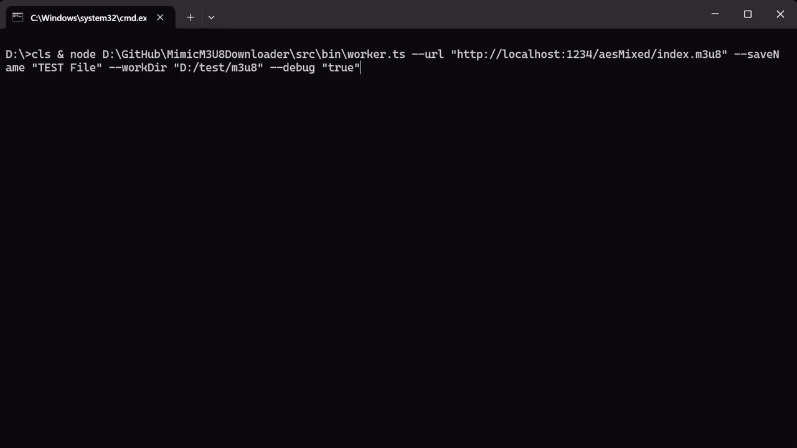

# MimicM3U8Downloader 拟态M3U8下载器

🚀 **一款可对抗防爬策略的反TLS指纹 M3U8 视频流下载器**

本项目基于 `impit` 库，能够**完美模拟真实浏览器的 TLS 指纹**，绕过人机验证，实现稳定、高速的m3u8分片下载与自动合并

GitHub: <https://github.com/DreamNya/MimicM3U8Downloader>

---

## ✨ 项目特性

* **TLS 指纹混淆**：模拟 Chrome 等主流浏览器的 TLS 握手特征，绕过 Cloudflare 防爬校验
* **多级 M3U8 嵌套解析**：支持 Master Playlist 递归解析，自动提取 BaseURL 并精准锁定最高清晰度视频流
* **动态 AES 解密**：流式解密标准 AES-128 加密分片，支持多密钥自动识别与平滑切换
* **精准区间下载**： 支持解析并下载指定范围（Range）的分片，满足按需下载需求
* **流式断点续传**：集成分片完整性校验机制，支持中断进度秒传，大幅减少重复磁盘 I/O 损耗
* **多线程高效并发**：采用多线程异步并发请求，最大化利用网络带宽，提升下载吞吐量
* **高性能流式合并**：支持分片内存暂存并实时写入 FFmpeg 管道，跳过中间产物损耗，降低约 50% 磁盘 I/O 开销，有效提升合并效率并延长 SSD 使用寿命。
* **FFmpeg 自动封装**：分片下载完成后自动调用 FFmpeg，实现无损、快速的合并与封装
* **三模一体化运行**

  1. **CLI 模式**：直接通过 Node.js 调用下载器
  2. **URL Protocol 协议**：支持浏览器或外部网页通过URL Protocol 协议唤醒下载器
  3. **HTTP 本地服务**：通过本地服务器 http 请求，一键唤醒下载器

### 预览



---

## 📦 安装

本项目有2种安装/使用方式可选，可根据自己实际情况选择

* Node.js模式需要在本地环境中安装Node.js，但可直接运行模块
* 编译模式无需安装Node.js，但编译文件解压后文件体积较大

### Node.js模式

克隆项目

```bash
git clone https://github.com/DreamNya/MimicM3U8Downloader.git
cd MimicM3U8Downloader
npm install
```

### 编译模式

下载编译后的文件

GitHub Release（多平台）

```text
https://github.com/DreamNya/MimicM3U8Downloader/releases
```

蓝奏云分流（仅windows）

```text
https://wwbwh.lanzouw.com/b01d72je4h
密码:496r
```

---

## 🛠️ 前置准备

### Node.js

> 编译模式可跳过

安装 **Node.js v23.6.0 或更高版本**  (推荐: Node.js v24+ / latest LTS)

（低版本Node.js请手动添加flag`--experimental-strip-types`或使用`ts-node`）

### FFmpeg

无论是Node.js模式还是编译模式均需安装FFmpeg
请确保本地环境中已经安装 FFmpeg，且正确配置**环境变量**

---

## 📝 配置文件说明

项目包含两个全局配置文件，位于 `config/` 目录。

### 📂 config/server.setting.json

> 请将 `[example]config/server.setting.json` 复制为 `config/server.setting.json` 以正确生效用户配置

本地 http 服务器配置参数

| 参数              | 类型    | 默认值  | 说明
| ----------------- | ------- | --------| -------------------------------------------------
| `Port`            | string  | `12345` | 本地 http 服务监听端口

---

### 📂 config/worker.setting.json

> 请将 `[example]config/worker.setting.json` 复制为 `config/worker.setting.json` 以正确生效用户配置

下载器全局配置参数

| 参数                 | 类型    | 默认值     | 说明
| -------------------- | ------- | ---------- | -------------------------------------------------
| `browser`            | string  | `"chrome"` | 模拟 TLS 指纹浏览器名称 <br> 详见<https://apify.github.io/impit/js/types/Browser.html>
| `proxyUrl`           | string  | `""`       | 代理服务器地址，例如 `http://127.0.0.1:10808`
| `headers`            | object  | `{}`       | 请求头（同时用于请求m3u8文件及分片）（Referer、Cookies 等）
| `range`              | string  | `""`       | 分片选择范围 详见 [range设置格式](#range设置格式)
| `concurrency`        | number  | `16`       | 分片迸发请求数
| `maxRetries`         | number  | `3`        | 网络请求失败时自动重试次数（403 404时不会重试）
| `timeout`            | number  | `60000`    | 网络请求的超时毫秒（包含请求及连接时间，如果分片过大建议提高超时时间）
| `streamMerge`        | boolean | `false`    | 流式合并（启用后忽略`noMerge`, `forceMerge`） <br> 详见[下载模式对比](#下载模式对比)
| `noMerge`            | boolean | `false`    | 分片下载完毕不自动合并
| `forceMerge`         | boolean | `false`    | 下分片下载不完整时强制合并
| `enableDelAfterDone` | boolean | `false`    | 下载完毕后删除临时文件夹
| `pauseAfterDone`     | boolean | `true`     | 下载完毕后暂停交互窗口
| `debug`              | boolean | `false`    | 记录debug中间产物

---

### 🌐 Payload

每次调用下载器时必须传递的参数

| 参数             | 类型    | 是否必须传递   | 说明
| ---------------- | ------- | -------------- | -------------------------------------------------
| `url`            | string  | 必须           | m3u8 请求地址
| `saveName`       | string  | 必须           | 视频存储文件名（不包括后缀）
| `workDir`        | number  | 必须           | 视频存储目录（临时文件也会存储在该目录下）

其余非必须传递参数与下载器全局配置参数规则相同，如果传递则在该次调用中覆盖全局配置中对应的配置

### 📎 配置附录

#### 下载模式对比

| 模式对比 | 缓存后再合并 | 流式实时合并
| -------- | ---------------------- | ----------------------
| **配置项** | `streamMerge: false` （默认值） | `streamMerge: true`
| **工作原理** | 流式下载分片 ➔ **流式写入硬盘缓存**  <br> ➔ 读取所有缓存 ➔ 调用 FFmpeg 合并  <br> ➔ **写入最终视频** | 流式下载分片 ➔ **暂存内存**  <br> ➔ 按顺序推入 FFmpeg 流 ➔ **实时流式写入最终视频**
| **磁盘写入量** | **2 倍** 视频大小 | **1 倍** 视频大小
| **断点续传** | 🌟 **支持** <br> 所有分片均会缓存到本地 | ❌ **不支持** <br> 任意分片超出最大重试次数则全部报废
| **网络要求** | **普通** | **非常高** <br> 如果反复失败建议放宽下载配置或更换模式
| **内存占用** | 无额外占用 | 最多额外占用 `[迸发数 * 分片平均大小]` 内存

#### range设置格式

*以下格式2选1，不可混用

| 范围分类         | 示例格式                                 | 实际下载范围 / 行为说明
| ---------------- | ---------------------------------------- | ------------------------------------------
| **索引格式**     | `"123,128,130"`                          | 仅下载索引为 123、128、130 的分片，多段之间用逗号 `,` 分割
| (数字索引)       | `"120-"`                                 | 下载从第 120 分片开始的所有后续分片
|                  | `"120-200"`                              | 下载闭区间 120 ~ 200 之间的所有分片
|                  | `"-200"`                                 | 下载从开头第 0 分片到第 200 分片的所有分片
|                  | `"110,120-130,150-180,185"`              | 支持复合区间（用`,`分隔）： <br> 同时下载 110、120～130、150～180 以及 185 分片
| **时间轴格式**   | `"00:00:28-"`                            | 下载视频 28 秒之后的所有分片
| (时间文本)       | `"-00:10:00"`                            | 下载视频 10 分钟之前的所有分片
|                  | `"00:00:28-00:10:00"`                    | 下载视频 28 秒到 10 分钟之间的所有分片
|                  | `"00:00:28-00:10:00,00:15:00-00:16:00"`  | 支持复合时间（用`,`分隔）： <br> 下载 28 秒～10 分钟 和 15 分钟～16 分钟内的所有分片

#### 配置优先级

同一配置项存在多个来源时，按以下优先级覆盖（高 → 低）：

1. `Payload` 传递的参数
2. `worker.setting.json` 中配置的全局静态参数
3. 下载器默认兜底参数

## 🚀 使用方法

下载器接收的数据格式为：

```text
m3u8mimic://<Base64(JSON Payload)>
```

Payload 格式参考

```json
{
  "url": "https://example.com/target.m3u8",
  "saveName": "视频保存名称",
  "workDir": "D:/m3u8",
  "headers": {
    "Referer": "https://example.com/",
    "Origin": "https://example.com/",
    "Cookie": "XXX",
  }
}
```

中文Base64编码参考

``` ts
function BTOA(str: string): string {
    return btoa(String.fromCodePoint(...new TextEncoder().encode(str)));
}
```

---

### 模式一：CLI 命令行

直接在CLI中通过`--`传递参数  
*--headers必须为标准JSON*

* **Node.js模式**

```bash
node src/bin/worker.ts --url "https://example.com/target.m3u8" --saveName "视频保存名称" --workDir "D:/m3u8" --headers "{\"Referer\":\"https://example.com/\"}'
```

* **编译模式**

```bash
MimicM3U8Downloader --url "https://example.com/target.m3u8" --saveName "视频保存名称" --workDir "D:/m3u8" --headers "{\"Referer\":\"https://example.com/\"}'
```

---

### 模式二：URL Protocol 唤醒

注册 Windows URL Protocol 后，可以直接在浏览器或其他程序中访问`m3u8mimic://`协议链接启动下载器

#### 调用方式

在浏览器或本地直接打开协议链接即可

```text
m3u8mimic://<Base64(JSON Payload)>
```

例如：

```text
m3u8mimic://eyJ1cmwiOiJodHRwczovL2V4YW1wbGUuY29tL3RhcmdldC5tM3U4Iiwic2F2ZU5hbWUiOiLop4bpopHkv53lrZjlkI3np7AiLCJ3b3JrRGlyIjoiRDovbTN1OCIsImhlYWRlcnMiOnsiUmVmZXJlciI6Imh0dHBzOi8vZXhhbXBsZS5jb20ifX0=
```

#### 注册/更新/卸载协议

> 仅需注册一次、无需管理员权限、模块会自动配置调用路径

* **Node.js模式**

注册/更新协议

```bash
npm run registerUrlProtocol
```

卸载协议：

```bash
npm run unregisterUrlProtocol
```

* **编译模式**

注册/更新协议

```bash
MimicM3U8Downloader --register
```

卸载协议：

```bash
MimicM3U8Downloader --unregister
```

---

### 模式三：HTTP 本地服务

适合作为浏览器脚本或其他应用调用

> http本地监听模块与下载模块进程间互相独立，一方关闭不会影响另一方

默认监听（监听端口可通过`config/server.setting.json`修改）

```text
http://127.0.0.1:12345
```

#### 启动服务

* **Node.js模式**

```bash
npm run server
```

* **编译模式**

> 不要传递任何 -- 参数，否则视为CLI命令行模式直接调用下载模块（windows系统中直接双击运行即可）

```bash
MimicM3U8Downloader
```

#### 请求示例（UserScript）

```javascript
GM_xmlhttpRequest({
    url: 'http://127.0.0.1:12345',
    method: 'POST',
    headers: {
        'Content-Type': 'application/json',
    },
    data: JSON.stringify({
        url: 'https://example.com/target.m3u8',
        saveName: '视频保存名称',
        workDir: 'D:/m3u8',
        headers: {
            Referer: location.href,
        },
    }),
    onload: (xhr) => console.log(xhr),
});
```

#### 请求示例（curl）

```bash
curl -X POST "http://127.0.0.1:12345" \
  -H "Content-Type: application/json" \
  -d '{
    "url": "https://example.com/target.m3u8",
    "saveName": "视频保存名称",
    "workDir": "D:/m3u8",
    "headers": {
      "Referer": "https://example.com"
    }
  }'
```

---

## 💻 开发

本项目在部分设计方面参考了`N_m3u8DL-CLI`项目

### SEA单文件编译

本项目依赖TypeScript / ESM架构 / C++编译库，开发环境采用 Node.js，仅 SEA 编译环境使用 Bun

手动SEA编译方法（单平台）

```bash
bun run build
```

GitHub Action（多平台）

```bash
.github\workflows\build.yml
```

### TODO

* [ ] SAMPLE-AES解密 （不含DRM）
* [ ] 解析本地m3u8
* [ ] 前端GUI

---

## 📄 开源协议

本项目基于 **MIT License** 开源
